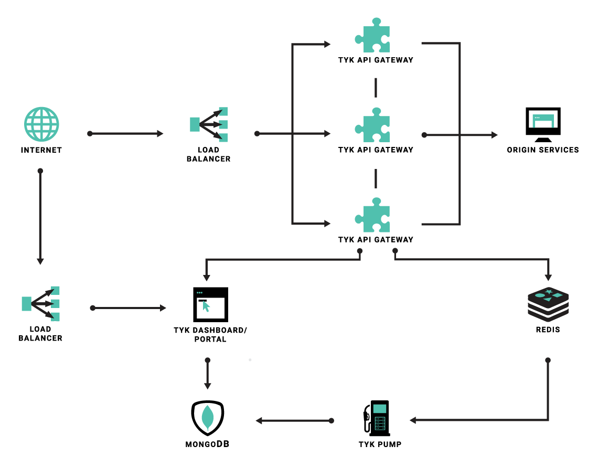

## tyk

- API 的访问权限控制
- 访问流量限制
- 监控机制

## 使用方式

- [Cloud](https://tyk.io/docs/get-started/with-tyk-cloud/)
- [Hybrid](https://tyk.io/docs/get-started/with-tyk-hybrid/)
- [On-Premises](https://tyk.io/docs/get-started/with-tyk-on-premise/)

## 参看链接
- [docker-compose启动tyk](tyk-docker/README.md)
- [使用步骤](tutorial.md)
- [dashboard api](dashboard_api/README.md)
- [rest api](rest_api/README.md)
- [uptime](uptime_test.md)
- [portal](Portal/README.md)