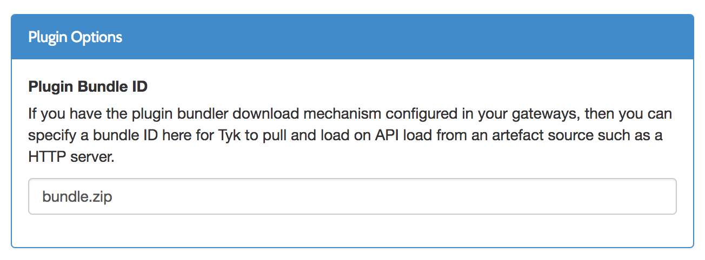
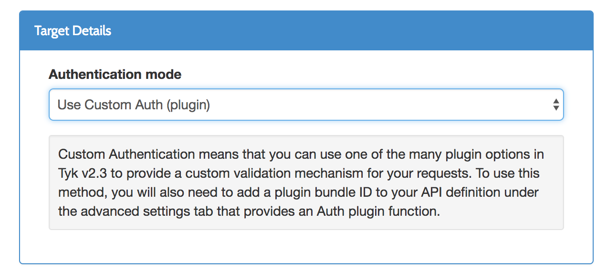

# 插件


**注意：需要手动在middleware目录创建bundles目录**

## 配置

### tyk配置
```
"coprocess_options": {
    "enable_coprocess": true,
},
"enable_bundle_downloader": true,
"bundle_base_url": "http://192.168.2.80:8000/",//提供插件包下载的服务器
"public_key_path": "/path/to/my/pubkey"

```
### api配置
- "custom_middleware_bundle": "bundle.zip" //bundle.zip插件报的名字



- "use_keyless": false "enable_coprocess_auth": true


