## 使用步骤

- [1. 添加新的api](#1)
    - [1.1 dashboard方式](#1.1)
    - [1.2 api的形式](#1.2)
- [2. 添加policy](#2)
    - [2.1 dashboard方式](#2.1)
    - [2.2 api的形式](#2.2)  
- [3. 将api发布到portal](#3)
- [4. 使用发布到portal的api](#4)

<h2 id="1">添加新的api</h2>

网关中的定义的api是外部访问对应内部服务的入口

<h3 id="1.1">dashboard方式</h3>

- 第一步 从System Management章节选择Apis模块

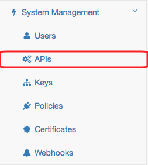

- 第二步 点击  "Add new API" 按钮

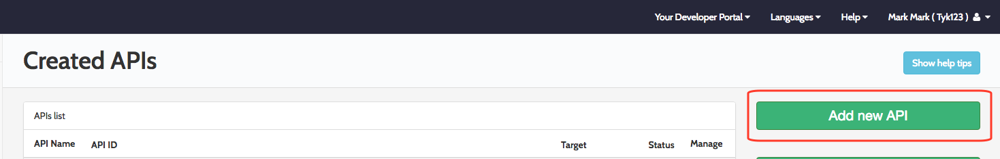

- 第三步 基本api的设置

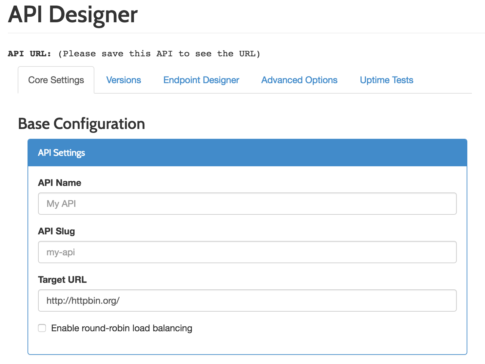

- 第四步 设置api的安全选项

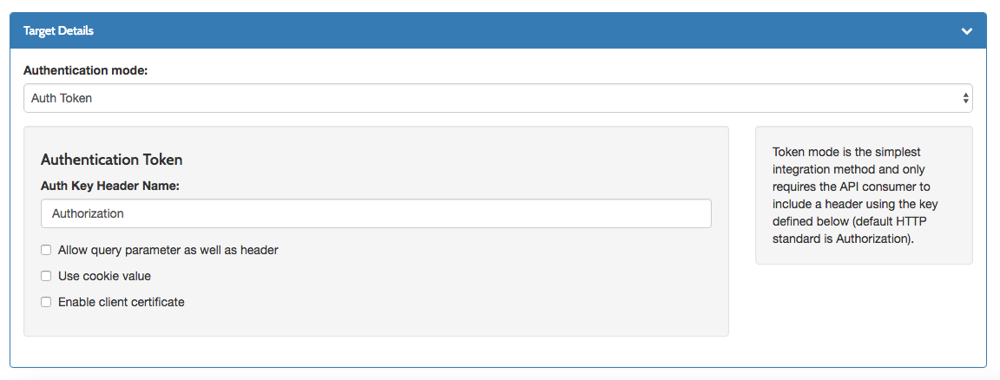

- 第五步 保存api

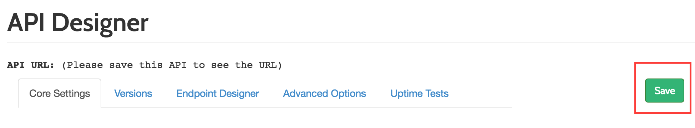

- 第六步 查看api的url

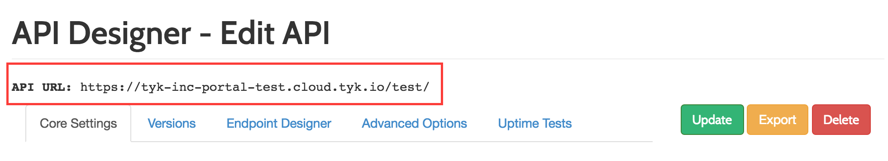

<h3 id="1.2">api的形式</h3>

[参考链接](dashboard_api/api_manage.md)

<h2 id="2">添加policy</h2>

policy是api key配置的模板

<h3 id="2.1">dashboard方式</h3>

- 第一步 从System Management章节选择Policies模块

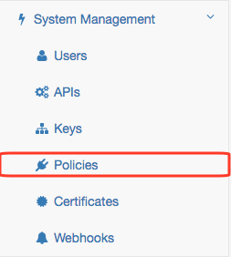

- 第二步 点击 Add Policy 按钮

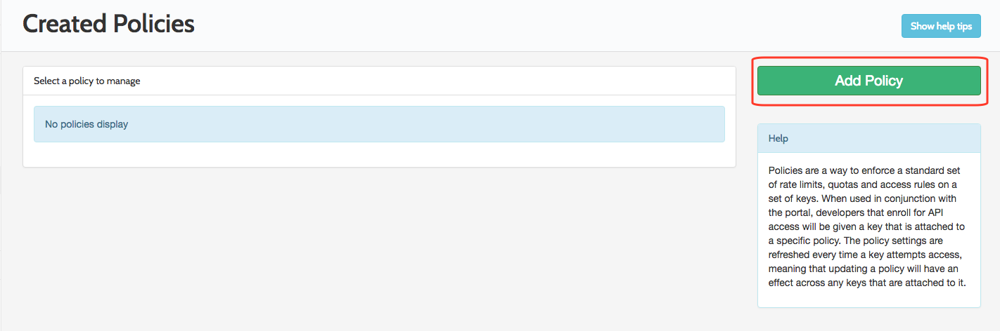

- 第三步 给创建的policy取一个名字

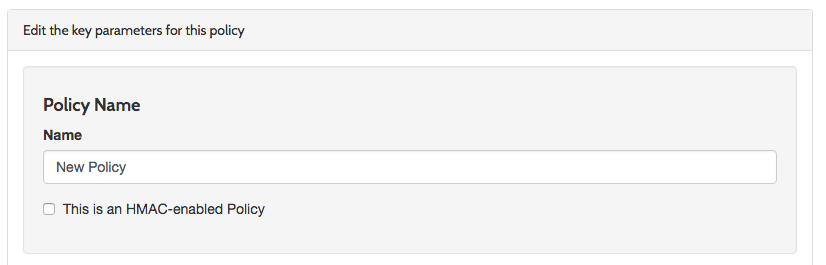

- 第四步 设置速率

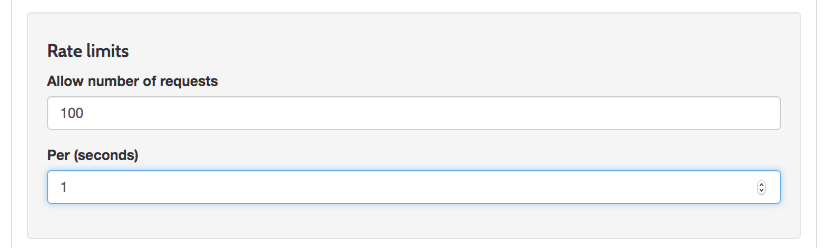

- 第五步 设置使用配额

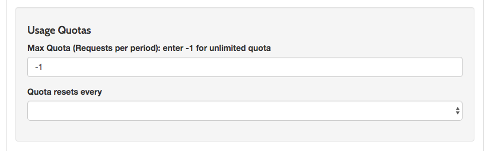

- 第六步 添加security entry

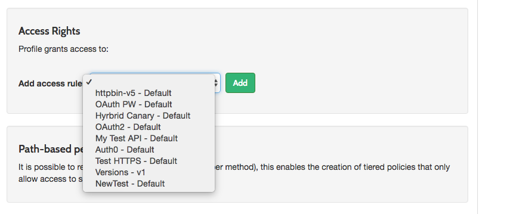

- 第七步 保存设置

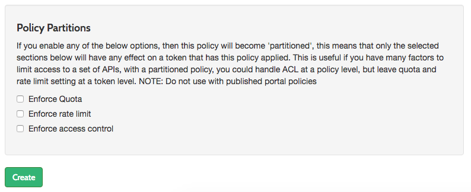

<h3 id="2.2">api的形式</h3>

[参考链接](dashboard_api/policy.md)

<h2 id="3">将api发布到portal</h2>
<h3 id="3.1">dashboard</h3>

- 第一步 从Portal Management章节选择Catalogue模块

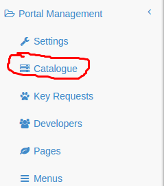

- 第二步 点击 Add New API 按钮

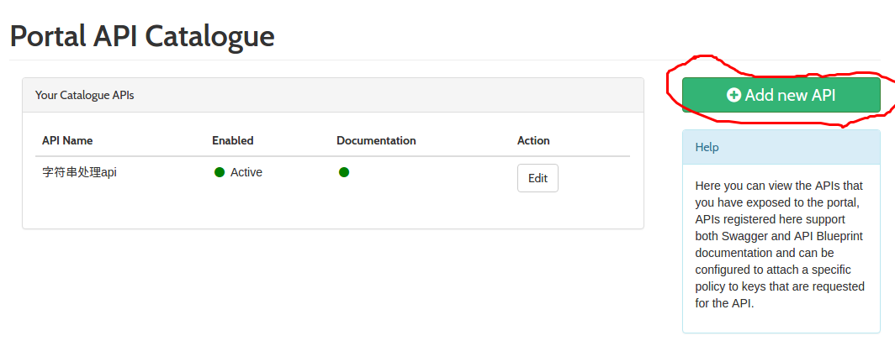

- 第三步 给创建的public api取一个名字

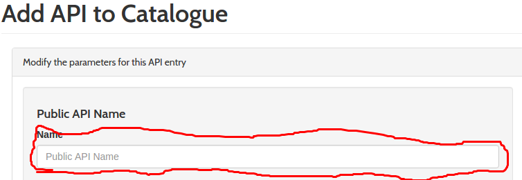

- 第四步 选择策略

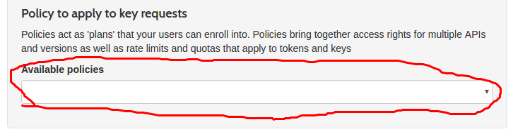

- 第五步 让发布的api有效

- 第六步 保存设置

- 第七步 添加api文档

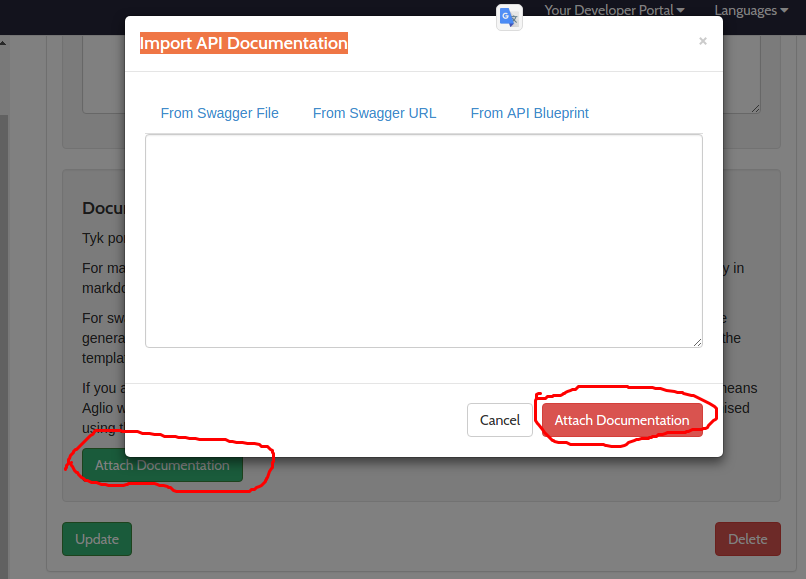

<h2 id="4">使用发布到portal的api</h2>

- 第一步 注册帐号
- 第二步 登录portal
- 第三步 点击导航栏的"API Catalogue"
- 点击api的"Request an API key"按钮
- 点击"Request Key"按钮
- 获取到api的key
